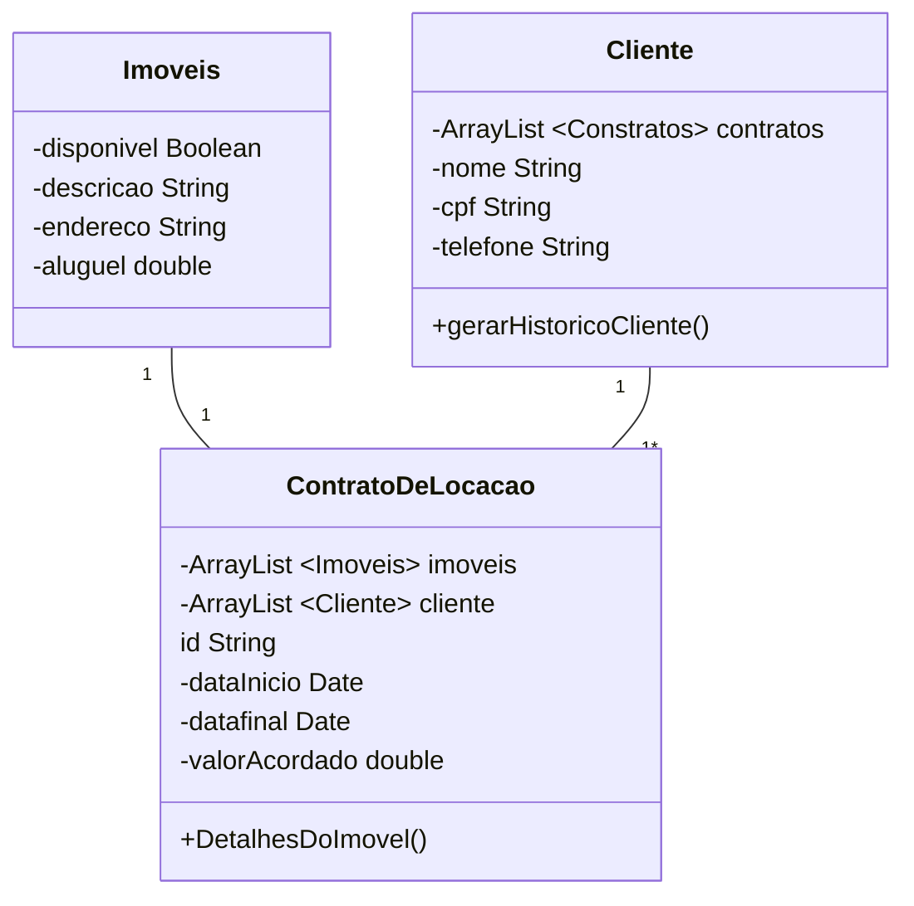

```mermaid
classDiagram
    
    Imoveis "1"--"1" ContratoDeLocacao
    Cliente "1"--"1*" ContratoDeLocacao
     
    
    class Imoveis{
        -disponivel Boolean 
        -descricao String
        -endereco String
        -aluguel double
    }
    
    class Cliente{
        -ArrayList ~Constratos~ contratos
        -nome String
        -cpf String
        -telefone String
        +gerarHistoricoCliente()
    }
    
    class ContratoDeLocacao{

        -ArrayList ~Imoveis~ imoveis
        -ArrayList ~Cliente~ cliente
        id String
        -dataInicio Date
        -datafinal Date
        -valorAcordado double
        +DetalhesDoImovel()
        
    }
    


```